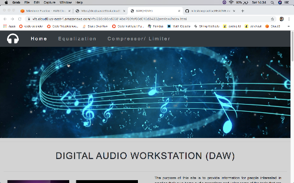
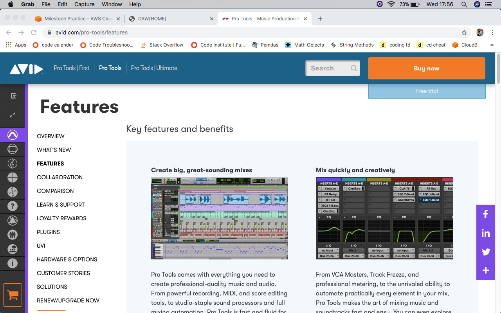
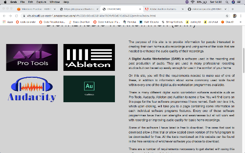
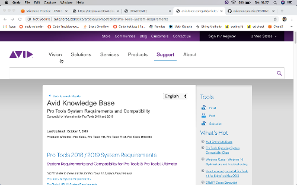

# Digital Audio Workstations
For my first milestone project, I chose to create a website containing information on digital audio workstations and different software available to allow a user to start recording high quality audio from their home. I have listed the requirements neccessary for a user to make use of this method of recording and enhancing their audio.  
The site also has some information on audio post production tools contained within the software programs which will allow a user to enhance the audio quality of their recordings after the audio is recorded. 
A deployed verseion of this website can be found here: https://djjtyn.github.io/milestonepractise/
## UX
This website is aimed at people who are interested in learning about recording audio from their home and the process involved to enhance the audio quality of their recordings after they have recorded their audio.  
As a user, I want to find out about some software available for download to allow me to make good quality home audio recordings and learn about the features of the specific software listed on the site. This is done by clicking on any of the sotware icons on the Home page which will take the user to each softwares features. 
As a user, I want to find out about the requirements neccessary to make use of such software. To read about I want to ascertain information on commonly used tools found within the sotfware programs to make the audio sound better and learn what these tools do to the recorded audio when applied.ed 
I have created wireframes for each of the pages and have included them in a wireframe folder within the project. These wireframes are titled "page1.png","page2.png" and "page3.png". As I progressed throughout the project I changed the images for certain parts of the pages but kept the page layout template I created within the wireframes. 
## Features
### Navbar
I have created a navigation bar which consists of three clickable page headings which are "Home", "Equalization" and "Compressor/Limiter". The currently selected page becomes highlighted and the pages that arent selected appear darker. In addition to the page headings I have included a font awesome icon of a headphone in the navigation bar  
I have incorporated javascript into the navbar by allowing a navbar toggler button to appear in place of the menu headings which contains the nav headings once the screen is at a certain width to incorporate some responsive design into the project 
The navbar and the image directly below the navbar are both common features on all the pages included in the project. 
### Home Page
The home page on the site consists of an explanation of what a digital audio workstation is. Also included in this section are a few examples of the existing software available accompanied by pictures of the software logos. Each software icon logo is a link to that particular softwares website which gives information on the features available in that particular software. 
Below this, I have listed the requirements neccessary to start producing high quality home audio. These requirement sections consist of computers, audio interfaces and microphones with pictures of each component beside their text areas. 
Found within the computer section is a list of hyperlinks for both apple and windows computers which give details of the computer specifications required to run the software. I have included font awesome icons for both apple and windows symbols which accompany the text stating what each link is for. This is to help the user decide on which audio interface would be best suited for them. 
Found within the audio interface section is a hyperlink to a website which gives a list of some of the best audio interfaces available in 2019. 
Found within the microphone section is a hyperlink to a website which gives a list of some of the best budget microphones available for home recording. This is to help the user choose which microphone to buy which would be best suited to them.
### Equalization Page
The Equalization page consists of an explanation of what EQ is and why it is important in audio production. I also give explanations on different types of Equalisers available accompanied with screenshots of the stock pro tools EQ plug ins available.
### Compressor/Limiter Page
The Compressor/Limiter page consists of an explanation of what both these tools do and why they are important in audio production with the explanations accompanied by screenshots for each audio tool. 
### Footer
The footer is common for every page of the project. It consists of links to websites that are well renowned for audio production advice and a copyright for the projects page. 
I have created icons for the links using font awesome icons for the website, facebook and youtube pages of each link related to it.If the user clicks on the facebook icon for a particular link, they will be taken to the pages facebook page. If a user clicks on the youtube icon for a link, they will be taken to the links youtube channel, If a user clicks on the internet icon for a link, they will be taken to the links website. These links change colour with a transition when the mouse hovers over them. The website icons colour will change to green, the facebook icons colour will change to blue and the youtube icons colour will change to red   
### External Links
All external links open in a new browser tab when selected.
### Future Plans
Future plans for this project could be to have more navigation bar options to give information on tools found within the software and tips on using them.
## Technologies Used
* HTML 
This project uses HTML to provide the structure of the pages.
* CSS 
This project uses CSS to provide styling to the HTML structure.
* Bootstrap 
I have used a lot of the bootstrap grid system in this project to help provide further structure to the page.
* JavaScript 
I have incorporated JavaScript in this project to allow the navigation headings to be shown in a toggle button once the screen width gets to a particular size.

## Testing

### Multi Page Switching Test (TEST PASSED)

### Navbar Toggler

### Navbar Toggler Active (TEST PASSED)

### Pro Tools Icon Click Action

### Pro Tools Icon Click Result (TEST PASSED)

### Ableton Icon Click Action

### Ableton Icon Click Result (TEST PASSED)

### Audacity Icon Click Action

### Audcity Icon Click Result (TEST PASSED)

### Audition Icon Click Action

### Audition Icon Click Result (TEST PASSED)

### Audacity On Windows Click Action

### Audacity On Windows Click Result (TEST PASSED)

### Audacity On MAC Click Action

### Audacity On MAC Click Result (TEST PASSED)

### Ableton On Windows and MAC Click Action

### Ableton On Windows and MAC Click Result (TEST PASSED)

### ProTools On Windows and MAC Click Action

### ProTools On Wndows and MAC Click Result (TEST PASSED)

### Audition On Windows and MAC Click Action

### Audition On Windows and MAC Click Result (TEST PASSED)

### Validation

The HTML validation was done using the HTML validator tool found at "https://validator.w3.org/". It showed a few errors in the coding for the software icons but I was able to resolve these by adding alt attributes to each icon. 
The CSS validation was done using the CSS validator tool found at "https://jigsaw.w3.org/css-validator/" and this test returned no errors.

### Bootstrap
I had some issues with using the bootstrap grid system, in which the text would overlap the images or the images would overlap the text at some parts of the site. I deleted all the original bootstrap code I had coded and started again being more cautious which resolved this. 

### Images
I changed the image underneath the Navbar to a different image than the one I did my wireframe for. This was due to the collapsable feature on the navbar when the screen gets to a certain width. The text became unreadable with the image included in my wireframe. 

### Layout
I was originally going to keep every paragraph on the right hand side of the pages and every pictures on the left hand side but I found that alternating these arrangements better suited the project. 
On larger screens the navigation bar headings appear in a line and on smaller screens (767px and below) these headings are condensed into a toggle button list. 
On larger screens the pictures and paragraphs share the screen and on smaller screens (767px and below) the layout changes so that the pictures take up the full size of the screen with the accompanying picture either abover or below the text.
## Deployment
I have deployed this project to GitHub. I have done this by creating a repository on the Github website and pushing the project to the repository using the projects terminal window. 
Throughout the project I have also made use of the local git using the projects terminal and have added and committed changes to this as I progressed throughout the project. 
Throughout the project I have created different github repositiories for this project. This was due to my lack of knowledge of retrieving the github directory name if I closed the Github page but as I progressed I learned that the changes would be sent to the original github master by using the git push command without the directory name included. 
## Credits
### Photos
A lot of the photos used for this project have been screenshots taken using my computer. 
For the common image below the navigation bar, I got this image from: https://cdn-images-1.medium.com/fit/t/800/240/1*C85p0nXx8jle1XoKfWCRYA.png  
For the Pro Tools software icon, I got this from:https://images.fmctraining.com/images/fmc-icon-avid-pro-tools-223x175.jpg 
For the Ableton software icon, I got this from:https://i.redd.it/meg6nawssnb01.jpg  
For the Audacity software icon, I got this from:https://crisponair.blog/2016/07/02/your-favourite-free-audio-editor-has-accessibility/ 
For the Audition software icon, I got this from: https://www.adobe.com/content/dam/acom/en/cc-wam/images/Au_446x272.jpg  
The Mac and Windows computer image I have is from: https://s3.amazonaws.com/images.ecwid.com/images/10833132/459077174.jpg  
The audio interface image I have is from: http://guitarrecordingpro.com/wp-content/uploads/2019/06/Best-Audio-Interfaces-For-Under-200-1024x512.jpg  
The microphones image I have is from:
https://static.sonovente.com/img/front/cms/21e4d5f4b5eca6f6b79677365c70d11c.jpg  
The common image for the intrductory paragraphs for the equalization page and the compressor/limiter page was found here: https://www.jakpost.travel/wimages/large/101-1013492_musical-background-white-treble-clef-moving-horizontal-music.png

